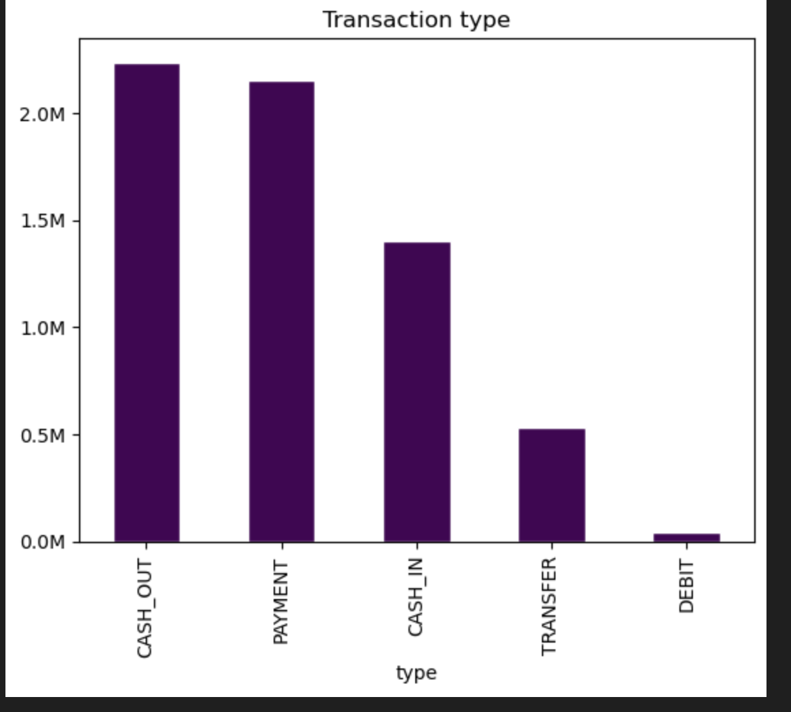
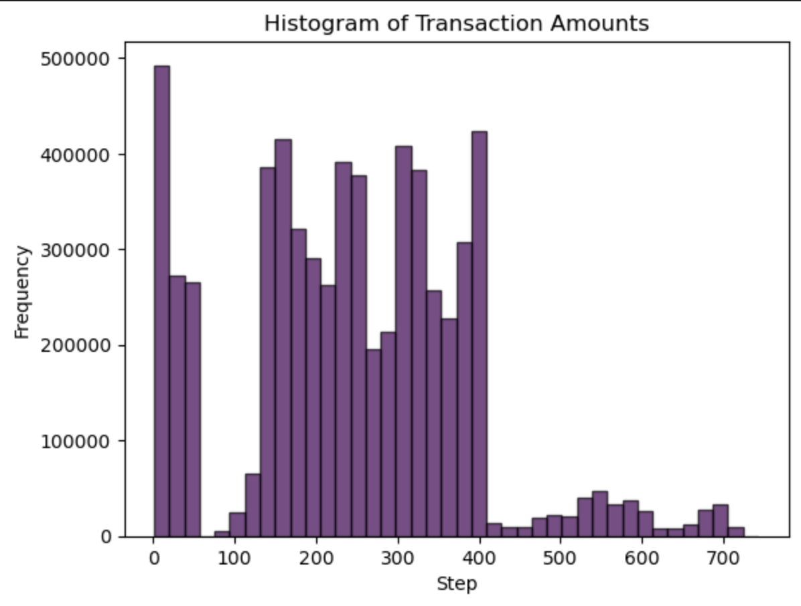
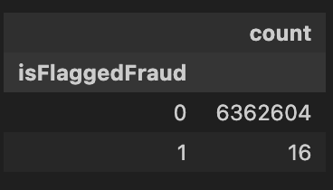
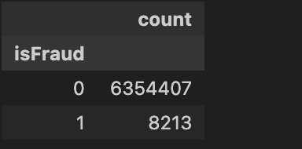
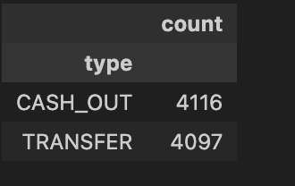
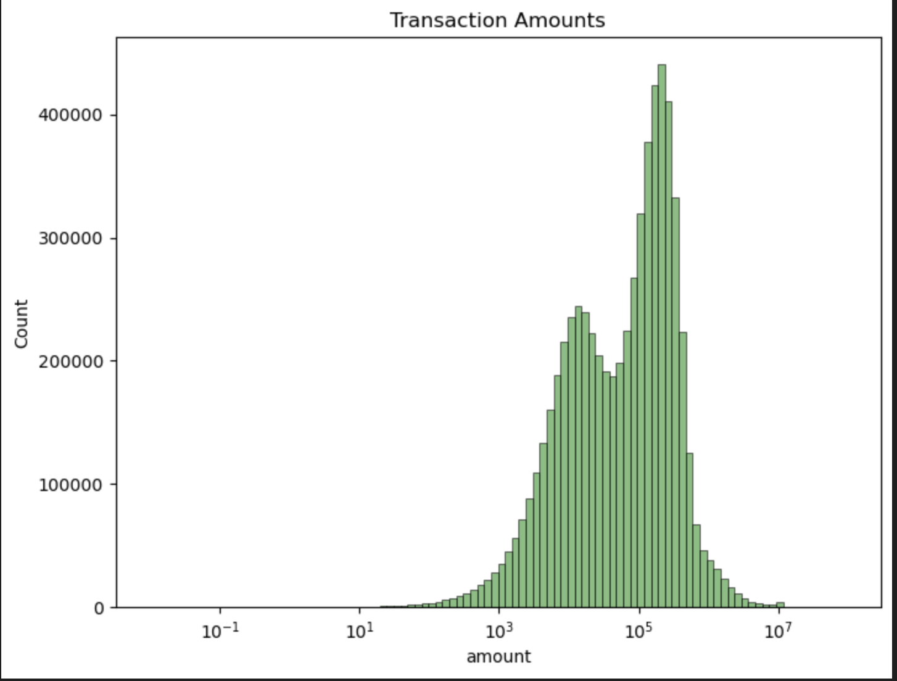
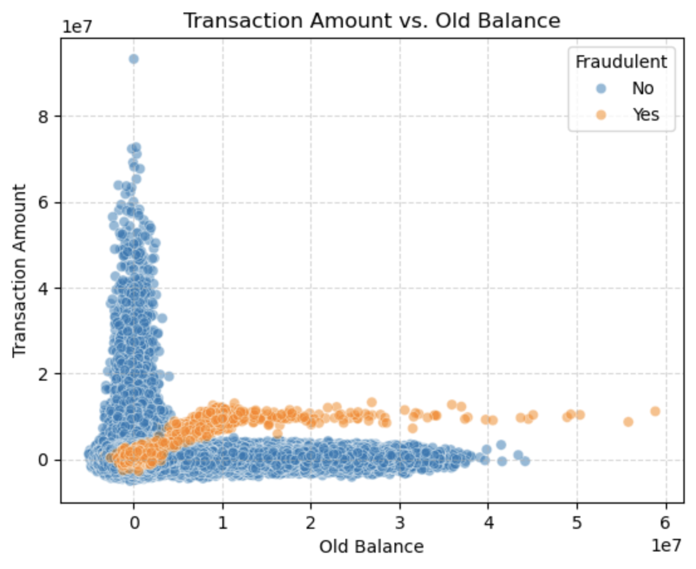
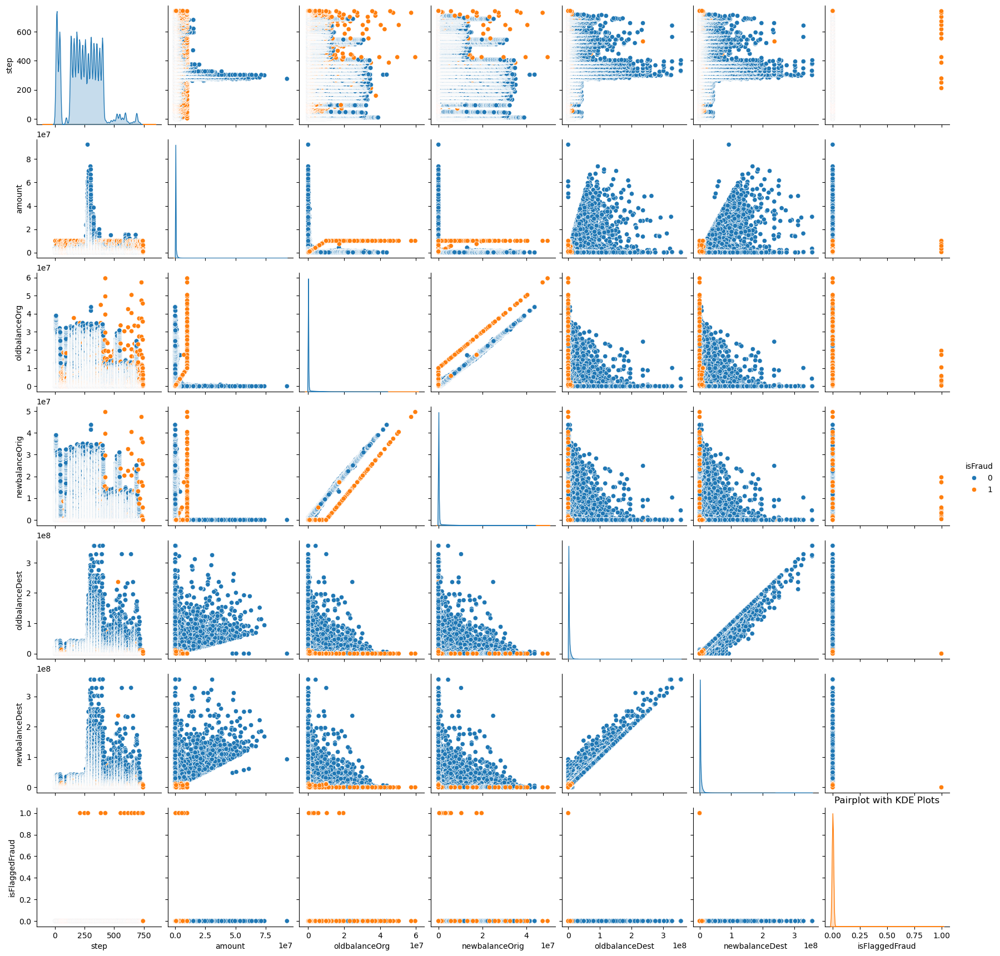
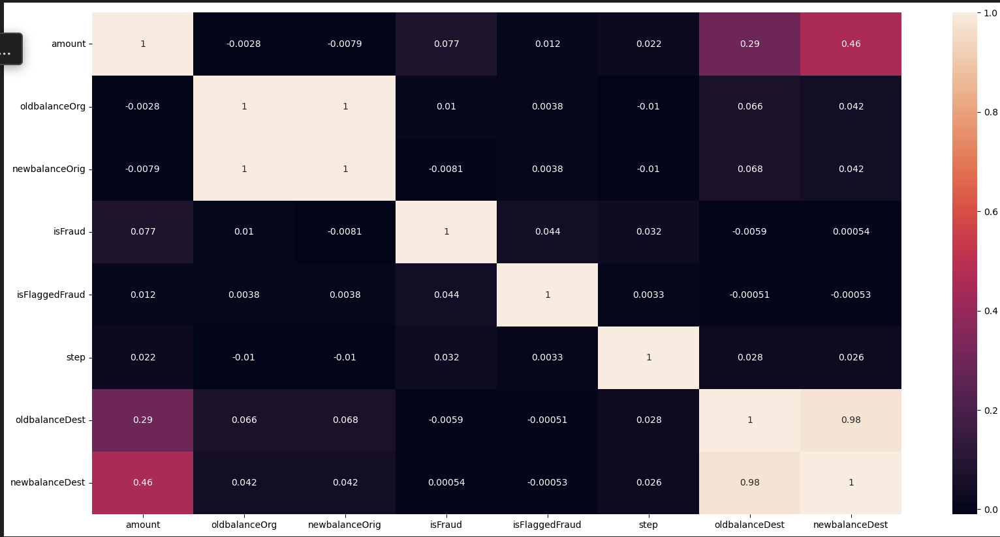

**This project explores financial transaction data to build a model for detecting fraudulent activity. It focuses on analyzing transaction patterns and evaluating model performance.**

# Fiancial Fraud Analysis and Modeling

# About Financial Fraud Dataset

*** In this Tlab project, we'll be exploring Financial fraud dataset to identify patterns and detect fraudulent transactions. Below is a  detailed  overview of variables within this dataset ***

* Step: A unit of time that represents hours in the dataset. Think of this as the timestamp of the transaction (e.g. hour 1, hour 2, … hour 534, …) 

* Type: The type of transaction 

* Amount: The amount of money transferred 

* NameOrig: The origin account name

* OldBalanceOrg: The origin accounts balance before the transaction 

* NewBalanceOrg: The origin accounts balance after the transaction 

* NameDest: The destination account name 

* OldbalanceDest: The destination accounts balance before the transaction 

* NewbalanceDest: The destination accounts balance after the transaction 

* IsFlaggedFraud: A “naive” model that simply flags a transaction as fraudulent if it is greater than 200,000 (note that this currency is not USD) 

* IsFraud: Was this simulated transaction actually fraudulent? In this case, we consider “fraud” to be a malicious transaction that aimed to transfer funds out of a victim’s bank account before the account owner could secure their information. 
***

 Modules/Libraries
* MatplotLib
* Numpy
* Pandas
* Seaborn
* Sklearn

## Univariate Anaysis

* **Cash-out transactions are the most frequent, exceeding 2 million occurrences, with payments following closely in second place**

* **We observe an initial surge in transaction frequency from step 0-100. Subsequently, the transaction frequency stabilizes between steps 100-400, followed by a period of low activity after step 400**

* **Fraudulent activity is heavily concentrated within the "CASH_OUT" and "TRANSFER" transaction types.**

* **This finding indicates that these two transaction types ("CASH_OUT" and "TRANSFER") should be prioritized for fraud detection and prevention measures.**

* **The graph exhibits two distinct modes, with a primary concentration between 10^5 and 10^6, and a secondary, less prominent mode around 10^3. However, the distribution is right-skewed.**

## Bivariate Anaysis

* **There are many non-fraudulent transactions that have a very high old balance, but a very low transaction amount.**

* **There's a noticeable separation between the fraudulent and non-fraudulent transaction patterns. This suggests that "Old Balance" and "Transaction Amount"are potential features that can help distinguish fraudulent activity**

* **The linear pattern in fraudulent transactions suggests that certain thresholds or ranges of "Old Balance" and "Transaction Amount" might be inductor of fraud**

## Multivariate Anaysis

* **Step distribution is highly skewed, showing a concentration of transactions at the beginning and then tapering off.**

* **Step shows little to no clear linear correlation with any other variable, as seen in the scattered patterns in the scatter plots**

* **Fraudulent transactions (isFraud)" show distinct patterns in relation to "oldbalanceDest", "newbalanceDest", and "amount".They tend to form a line, especially when plotted against the destination balances**

* **isFlaggedFraud is very rare, and has very little to no corelation with the other variables.**

* **The correlation  between oldbalanceDest and newbalanceDest coefficient is 0.98, which is very close to 1.**

* **This indicates a strong positive linear relationship. As the old balance of the destination account increases, the new balance of the destination account also increases proportionally.**

## Challenges :
* **Data Qualtiy**
* **Model Evaluation**
* **Class Imbalance**
* **Feature Engineering**