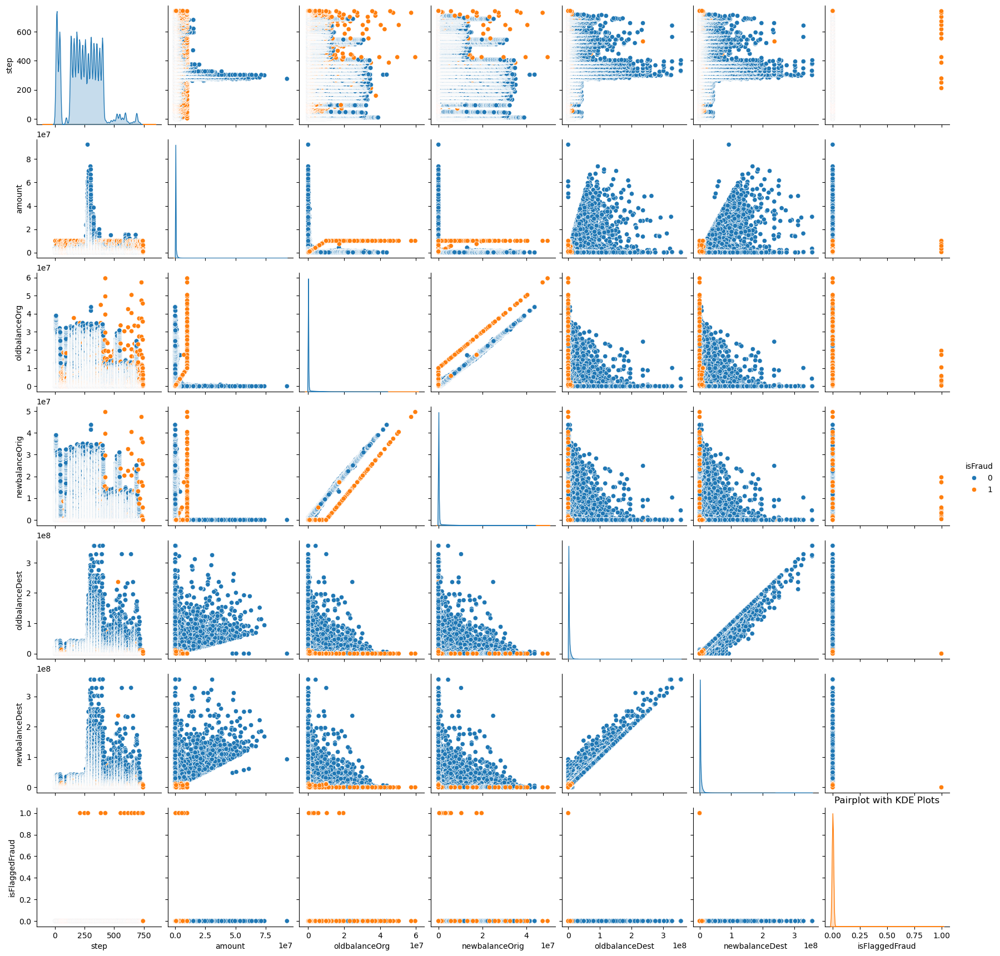

# Fiancial Fraud Analysis and Modeling

# Modules/Libraries
* MatplotLib
* Numpy
* Pandas
* Seaborn
* Sklearn

# Dataset Overview

# About Financial Fraud Dataset

*** In this Tlab project, we'll be exploring Financial fraud dataset to identify patterns and detect fraudulent transactions. Below is a  detailed  overview of variables within this dataset ***

* Step: A unit of time that represents hours in the dataset. Think of this as the timestamp of the transaction (e.g. hour 1, hour 2, … hour 534, …) 

* Type: The type of transaction 

* Amount: The amount of money transferred 

* NameOrig: The origin account name

* OldBalanceOrg: The origin accounts balance before the transaction 

* NewBalanceOrg: The origin accounts balance after the transaction 

* NameDest: The destination account name 

* OldbalanceDest: The destination accounts balance before the transaction 

* NewbalanceDest: The destination accounts balance after the transaction 

* IsFlaggedFraud: A “naive” model that simply flags a transaction as fraudulent if it is greater than 200,000 (note that this currency is not USD) 

* IsFraud: Was this simulated transaction actually fraudulent? In this case, we consider “fraud” to be a malicious transaction that aimed to transfer funds out of a victim’s bank account before the account owner could secure their information. 